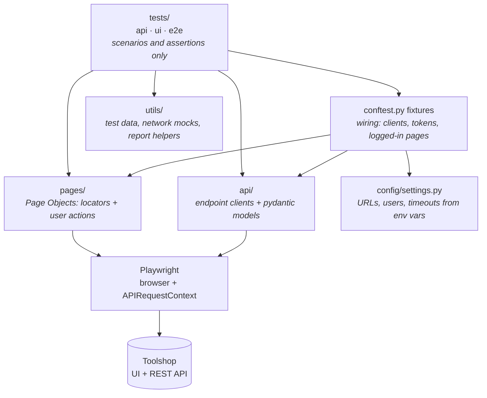

# Architecture and design decisions

This document explains **why** the framework is built the way it is: what each layer is
responsible for, how tests get their data and state, and what is deliberately left out.

## Layers



| Layer | Knows about | Does **not** know about |
|---|---|---|
| `tests/` | *what* to check (business rules) | locators, URLs, HTTP details |
| `pages/` | locators and UI actions of one page | assertions of business rules, test data |
| `api/` | endpoints, payloads, response schemas | which test calls it and why |
| `utils/` | how to build data / mocks / report files | tests |
| `config/` | environment | everything else |

Rules that keep the layers clean:

- Page objects **do not assert business outcomes**. They wait for the page to be ready
  (e.g. `search_completed`), but "the cart total is correct" belongs to the test.
- API clients **return the raw response**. The test decides whether 200, 403 or 422 is the
  expected result, which is what makes negative tests possible with the same client.
- Tests never contain selectors or URLs, so a UI change is fixed in one page object.

## Dependency injection with fixtures

pytest fixtures are the framework's DI container. A test declares what it needs by name and
receives a ready object; it never constructs clients, logs in or cleans up by itself.

```python
def test_checkout(customer_page, invoices_api, customer_token, payment_method): ...
```

| Fixture | Scope | Provides |
|---|---|---|
| `api_request` | session | one Playwright `APIRequestContext` for all API calls |
| `*_api` | session | endpoint clients sharing that context |
| `token_provider` | session | cached JWTs per user, re-login shortly before expiry |
| `customer_token`, `admin_token`, ... | function | a valid token for that role |
| `customer_page` | function | browser page already logged in as the customer |
| `page` | function | anonymous browser page (pytest-playwright) |

Scopes are chosen by cost vs. isolation: stateless and expensive things are session-wide,
anything that holds user state (tokens, browser contexts, carts) is per test.

## Authentication strategy

- Logging in through the form is tested **once** (`tests/ui/test_login.py`).
- Every other UI test that needs a user gets `customer_page`: the token is taken from the API
  and put into `localStorage` through Playwright `storage_state` before the app loads.
  This is faster and removes the login form as a source of flakiness in unrelated tests.
- Tokens live 5 minutes on Toolshop, so `TokenProvider` caches them and logs in again before
  expiry instead of keeping one token for the whole run.

AuthN vs AuthZ are tested separately (`tests/api/test_auth.py` vs `test_authorization.py`):

| Situation | Expected |
|---|---|
| no / invalid token | **401** Unauthorized (who are you?) |
| valid token, wrong role (customer → admin endpoint) | **403** Forbidden (not allowed) |
| valid token, someone else's resource (invoice) | **404** (do not reveal it exists) |

## Test isolation and data

- Each test creates what it needs: unique users (`Faker` + UUID emails), its own cart, its own order.
  No test depends on another test or on execution order, so the suite runs in parallel (`pytest-xdist`).
- Shared seeded accounts are only **read** (login, profile). Destructive checks use ids that do not
  exist, so even a missing permission check could not delete real data.
- In CI all suites run against a fresh copy of the app in Docker with a freshly seeded database,
  so runs never see leftovers from previous runs or other people using the public demo.

## Test pyramid in this project

| Level | Count (approx.) | Used for |
|---|---|---|
| API | 47 | business rules, validation, permissions, schemas: fast and precise |
| UI | 21 | what only the browser can show: rendering, navigation, forms, client-side behaviour |
| E2E | 4 | the critical path across UI + backend (checkout, registration) |

Most rules are verified through the API; the UI suite checks that the UI uses the API correctly.
E2E tests use the API for setup and verification: the checkout test buys through the UI and then
checks the stored invoice (total, address, lines) through the API.

## Network mocking

`utils/mocks.py` wraps `page.route()` for cases real data cannot produce on demand:

- server errors (500/503) to check the UI degrades gracefully;
- specific edge-case data (a product that only exists in the mocked response);
- a deterministic answer from an external dependency (postcode lookup) for UI-only tests.

The E2E checkout deliberately does **not** mock the postcode lookup: the backend validates that
the submitted city/state match the postcode, so the real lookup result must be used.

## Waiting strategy

No `sleep`. The framework waits on things that actually signal readiness:

- Playwright auto-waiting and web-first assertions (`expect(...).to_have_text(...)`);
- the app's own state markers (`data-test="search_completed"`, `sorting_completed`);
- specific network responses (`page.expect_response(...)`) when the UI fills fields asynchronously.

## Reporting

- Page object methods and API calls are Allure steps, so a report reads like the scenario.
- API steps attach request and response bodies (secrets masked).
- UI tests attach a final screenshot and URL; failed UI tests also keep a Playwright trace.
- Infrastructure fixtures are removed from the report, and results are grouped by
  API / UI / E2E with failure categories and trend history across CI runs.

## Known trade-offs

- By default (locally) the suites point at the public demo, which is shared: its data can change and its demo
  accounts can get locked by other people's failed logins (HTTP 423). CI therefore runs everything against a
  fresh Docker instance; locally, point `BASE_URL`/`API_URL` at Docker for the same isolation.
- Only Chromium runs in CI for now: cross-browser runs are the next step.
